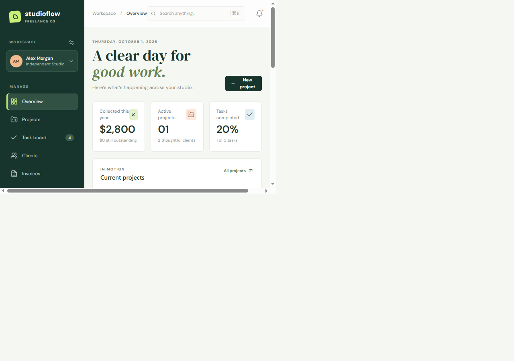
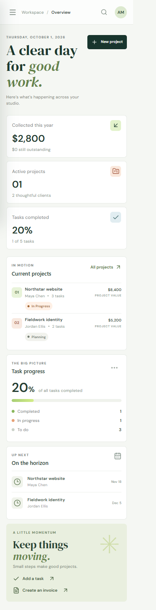

- Client profiles and project management with budgets, deadlines, status, deliverable URLs, and uploaded files (PDF, images, text, Word, or Excel; 10 MB maximum).



# Studioflow

Studioflow is a freelancer workspace for clients, projects, tasks, invoices, payments, and project history. The React client uses an Express API backed by SQLite. SQLite is the source of truth; the API creates and seeds `server/data.sqlite` on first start.

## Requirements

- Node.js 20.19+ (Node 24 recommended)
- npm 10+

## Local setup

```powershell
npm install
Copy-Item .env.example .env
npm run dev
```

Open `http://localhost:5173`. The development command starts Vite on port 5173 and the API on port 3001; Vite proxies `/api` requests to Express. On first API start, SQLite creates the schema and sample data. Remove `server/data.sqlite` to reset the local demo database.

For a production build and local API process:

```powershell
npm run build
$env:NODE_ENV = 'production'
npm start
```

The production API serves the built client from `dist` on port 3001. Set `PORT` if the host assigns another port.

## Environment variables

| Variable | Default | Purpose |
| --- | --- | --- |
| `PORT` | `3001` | Express listen port |
| `JWT_SECRET` | Development-only fallback | Signing key; set a long random value outside local development |
| `DATABASE_PATH` | `server/data.sqlite` | SQLite filename, relative to `server/` |
| `CLIENT_ORIGIN` | Any origin | Optional CORS origin when hosting client and API separately |
| `NODE_ENV` | — | Set to `production` to serve the React build and require `JWT_SECRET` |

Copy `.env.example` to `.env` and replace the signing key before deployment. Do not commit `.env` or SQLite database files.

## Demo accounts

All seeded users use password `studio123`.

| Role | Email |
| --- | --- |
| Freelancer | `alex@studioflow.app` |
| Client | `maya@northstar.studio` |
| Admin | `admin@studioflow.app` |

The freelancer account can manage clients, projects, tasks, invoices, and payment entries. The client account is limited to that client's own project data and cannot mutate records. The admin account has management access.

## Features

- Freelancer dashboard with collected earnings, outstanding balances, active projects, and task completion.
- Client profiles and project management with budgets, deadlines, status, deliverable URLs, and uploaded files (PDF, images, text, Word, or Excel; 10 MB maximum).
- Kanban task board with `To Do`, `In Progress`, and `Completed` states, priorities, and due dates.
- Invoice creation for projects with completed work, partial-payment tracking, and overpayment prevention.
- Project history for project creation, task changes, invoice creation, and payments.
- JWT sign-in, backend role checks, Zod input validation, empty/loading/error states, and responsive layouts.
- Project titles are unique per client (case-insensitive); SQLite enforces the constraint as the final authority.

## API overview

All routes except `GET /api/health` and `POST /api/auth/login` require `Authorization: Bearer <token>`.

| Method | Endpoint | Purpose |
| --- | --- | --- |
| `GET` | `/api/health` | Health check |
| `POST` | `/api/auth/login` | Sign in and receive a 12-hour JWT |
| `GET` | `/api/auth/me` | Current user and role |
| `GET`, `POST` | `/api/clients` | List or create clients |
| `PUT` | `/api/clients/:id` | Update a client |
| `GET`, `POST` | `/api/projects` | List or create projects |
| `PUT` | `/api/projects/:id` | Update a project |
| `POST` | `/api/projects/:id/attachment` | Upload a project deliverable |
| `GET` | `/uploads/:filename` | Retrieve an uploaded deliverable |
| `GET`, `POST` | `/api/tasks` | List or create tasks |
| `PUT` | `/api/tasks/:id/status` | Change task status |
| `GET`, `POST` | `/api/invoices` | List or create invoices |
| `POST` | `/api/invoices/:id/payments` | Record a partial or final payment |
| `GET` | `/api/payments` | Payment history |
| `GET` | `/api/history` | Project lifecycle activity |
| `GET` | `/api/dashboard/summary` | Earnings, project, and task summary |

The API returns JSON errors with appropriate `4xx` status codes for invalid data, duplicate project titles, permission violations, and overpayments. Invoice creation requires at least one completed task on its project.

## Database

The SQLite schema is initialized in `server/index.js` with foreign keys enabled and WAL journaling. Tables: `users`, `clients`, `projects`, `tasks`, `invoices`, `payments`, and `project_history`. Seed data is inserted only when the users table is empty. Back up `server/data.sqlite` to preserve local data.

## Deployment

Build with `npm run build` and start `npm start` with `NODE_ENV=production`, `JWT_SECRET`, and a persistent SQLite path configured. For hosts with ephemeral filesystems, attach a persistent disk and point `DATABASE_PATH` to it. The Node service serves both the API and React build from one origin.

## Screenshots


